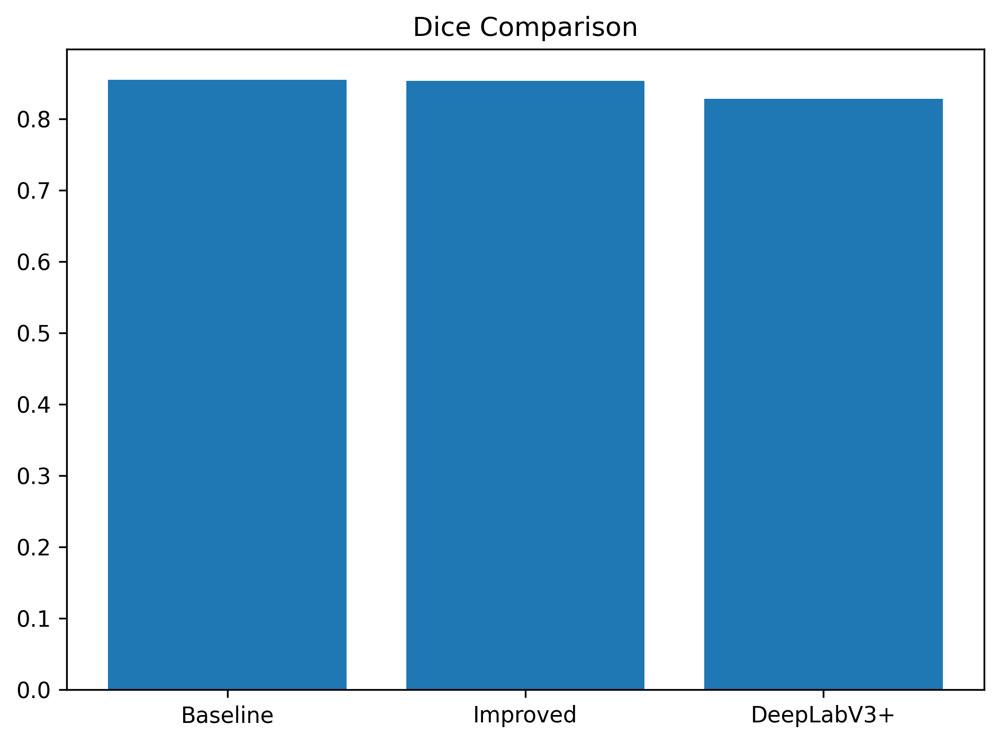
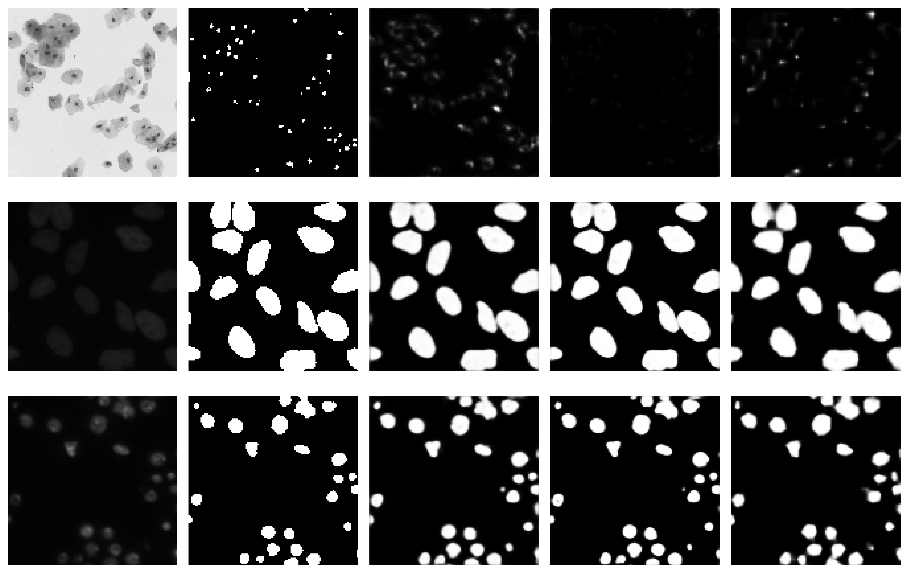
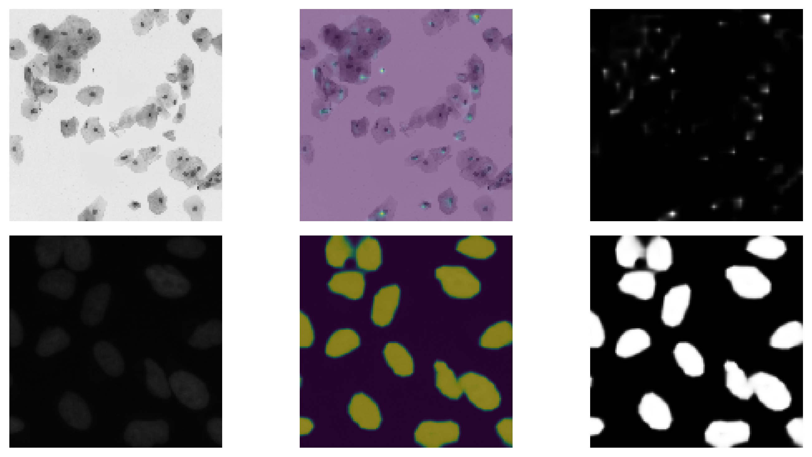
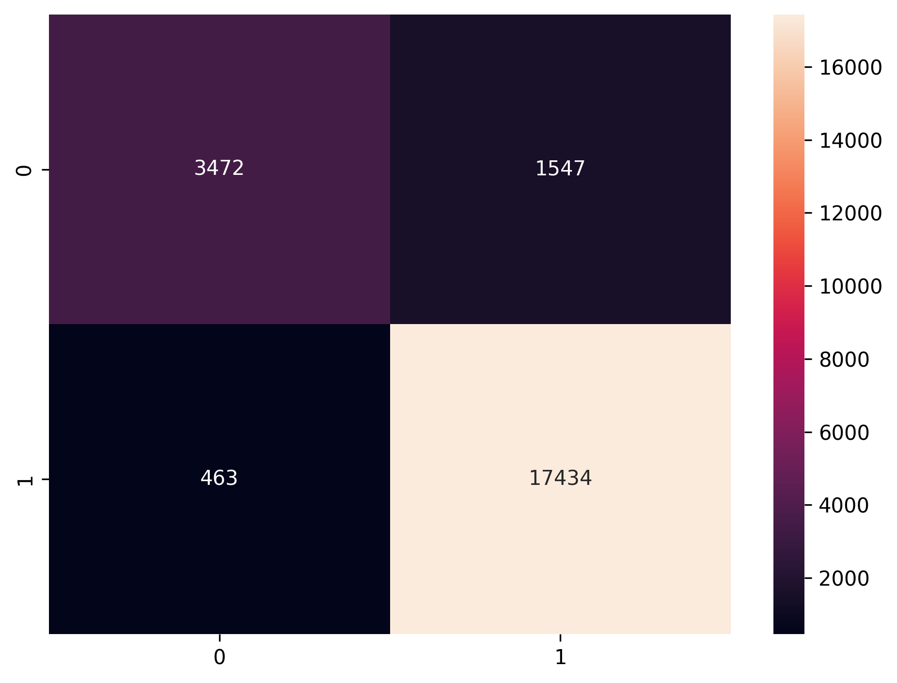

#  Cell Segmentation & Classification

##  Overview
End-to-end deep learning pipeline for:
-  Cell Segmentation (U-Net, DeepLabV3+)
-  Cell Extraction
-  Cell Classification (CNN)

---

##  Hugging Face Model
 **Live Model & Weights:**  
https://huggingface.co/mziarehman4353/cell-segmentation-bbbc038

---

## Results

### Segmentation Performance
| Model | Dice | IoU |
|------|------|------|
| U-Net (ResNet18) | 0.8680 | 0.7691 |
| U-Net (ResNet34) | 0.8188 | 0.6964 |
| DeepLabV3+ | 0.8495 | 0.7400 |

### Classification Performance
- Accuracy: 91.2%
- F1 Score: 94.3%

---

##  Visual Results

### Model Comparison


### Qualitative Predictions


### Overlay Predictions


### Confusion Matrix


---

## Run Locally

```bash
pip install -r requirements.txt

python train_segmentation.py
python train_classification.py
🧠 Model Details
Architecture: DeepLabV3+, U-Net
Encoder: ResNet18, ResNet34
Framework: PyTorch
Dataset: BBBC038
Project Structure
.
├── results/                 # Saved visual outputs
├── train_segmentation.py
├── train_classification.py
├── README.md
Author

Zia Ul Rehman Zafar
